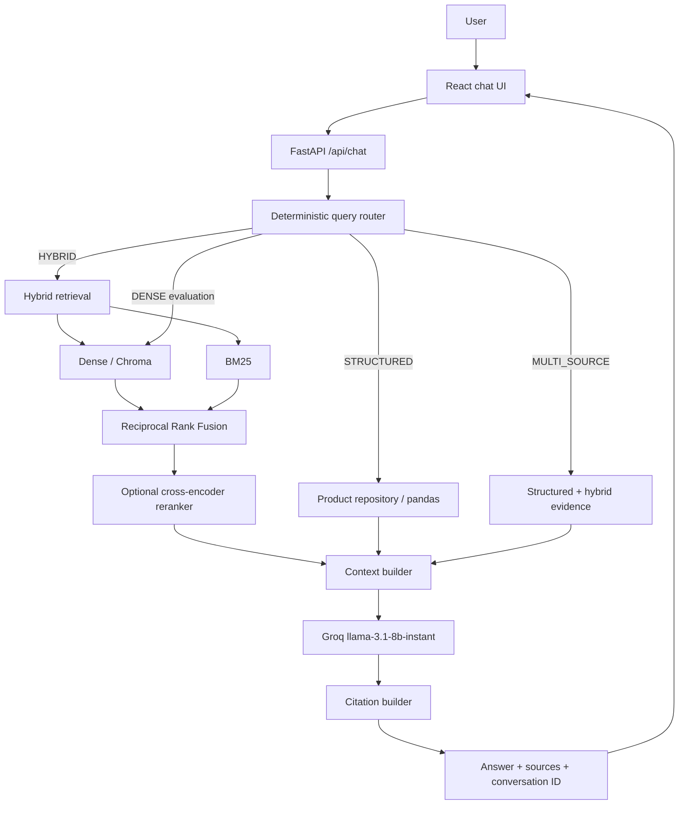

# NovaCart Hybrid RAG

> A production-oriented Hybrid RAG knowledge assistant for a fictional
> e-commerce company, with routed retrieval, grounded Groq generation,
> evidence-backed citations, a React chat interface, and reproducible
> evaluation.


## Why this project exists

Vector-only RAG is useful for semantic questions, but e-commerce support also
depends on exact product identifiers, prices, numeric filters, lexical matches,
and precise policy evidence. A single dense retriever can miss SKU-heavy or
structured questions, retrieve redundant chunks, and send weak context to the
LLM.

NovaCart combines complementary retrieval paths and keeps every answer
traceable to the evidence used to generate it.

## Solution

- **Dense retrieval** finds semantically similar passages using local
  Sentence Transformers embeddings and persistent Chroma storage.
- **BM25 retrieval** handles exact terms, product identifiers, and lexical
  matches.
- **Reciprocal Rank Fusion** combines ranks without adding incompatible raw
  dense and BM25 scores.
- **Optional reranking** scores a wider candidate set with a cross-encoder.
- **Structured retrieval** answers deterministic product lookups, filters, and
  comparisons from `products.csv`.
- **Query routing** selects hybrid, structured, multi-source, or dense
  evaluation paths.
- **Grounded generation** uses Groq only after evidence selection.
- **Citations** are built from server-side evidence metadata, never invented
  from LLM text.
- **Conversation continuity** supports narrow SKU follow-ups through a
  lightweight `conversation_id`.

## Architecture



See [architecture](docs/architecture.md), [retrieval details](docs/retrieval.md),
[evaluation](docs/evaluation.md), and [technical decisions](docs/decisions.md).

## UI

The React interface provides responsive chat, source cards, loading and error
states, Enter-to-send, multiline input, automatic scrolling, and session-level
conversation continuity. Retrieval diagnostics remain hidden unless
`VITE_SHOW_DEBUG=true`.

> **Screenshot placeholder:** add a final browser capture at
> `docs/assets/chat-ui.png` after deploying the portfolio demo.

## Measured retrieval quality

Stage C evaluated 10 questions against document-level relevance judgments.
These are measured local results at K=5 after model warm-up:

| Retriever | Hit@5 | Recall@5 | Precision@5 | MRR@5 | NDCG@5 | Mean latency |
| --- | ---: | ---: | ---: | ---: | ---: | ---: |
| Dense | 0.900 | 0.900 | 0.240 | 0.850 | 0.843 | 38.264 ms |
| BM25 | 1.000 | 1.000 | 0.260 | 0.750 | 0.807 | 0.458 ms |
| **Hybrid RRF** | **1.000** | **1.000** | **0.260** | **0.875** | **0.898** | 30.135 ms |
| Hybrid + Reranker | 0.900 | 0.900 | 0.240 | 0.850 | 0.855 | 8,278.079 ms |

Plain Hybrid RRF currently gives the best overall K=5 ranking. The configured
BGE reranker is expensive on CPU and reduced quality on one structured-filter
question, so reranking remains configurable. Full rankings and methodology are
in [docs/evaluation.md](docs/evaluation.md).

## Tech stack

| Layer | Technology |
| --- | --- |
| API | FastAPI, Pydantic Settings, Uvicorn |
| Frontend | React 19, Vite 8, CSS |
| Dense retrieval | Sentence Transformers, ChromaDB |
| Sparse retrieval | Project BM25 index |
| Fusion | Reciprocal Rank Fusion |
| Reranking | BGE cross-encoder |
| Structured data | pandas repository over CSV |
| Generation | Groq, `llama-3.1-8b-instant` |
| Parsing | PyMuPDF, python-docx, pandas |
| Packaging | Docker, Docker Compose, Nginx |
| Tests | pytest, FastAPI TestClient, Oxlint, Vite build |

## Project structure

```text
backend/app/
├── api/              FastAPI routes
├── chat/             Conversation-aware application service
├── chunking/         Structure-aware and CSV-safe chunking
├── conversations/    Process-local history and follow-up rewriting
├── embeddings/       Replaceable embedding provider
├── evaluation/       Metrics and benchmark runner
├── hybrid/           RRF fusion and hybrid retrieval
├── ingestion/        PDF, DOCX, and CSV parsing
├── rag/              Context, prompts, citations, and orchestration
├── reranking/        Cross-encoder reranking
├── retrieval/        Chroma store and dense retriever
├── routing/          Deterministic query router
├── sparse/           BM25 index and retriever
└── structured/       Product repository and query service

frontend/              React chat client and Nginx image
scripts/               Ingestion, indexing, query, and evaluation CLIs
data/raw/              NovaCart source documents
data/evaluation/       Questions, golden queries, and measured results
docs/                  Architecture, retrieval, decisions, and evaluation
tests/                 Focused backend and pipeline regression tests
```

## Dataset

The fictional NovaCart dataset under `data/raw/` contains product records,
returns, shipping, warranty, FAQ, company, and product-documentation sources in
CSV, PDF, and DOCX formats. The ingestion pipeline preserves document, page,
section, and source metadata through chunking, retrieval, generation, and
citations.

## Local development

### Prerequisites

- Python 3.11+
- Node.js 20.19+ or 22.12+
- A Groq API key

### 1. Configure the project

```powershell
git clone <your-repository-url>
cd novacart-hybrid-rag
Copy-Item .env.example .env
```

Set `GROQ_API_KEY` in `.env`. Do not commit that file.

### 2. Install backend dependencies

```powershell
python -m venv .venv
.\.venv\Scripts\python.exe -m pip install -r requirements.txt
```

### 3. Build retrieval indexes

The embedding and reranker models download from Hugging Face on first use.

```powershell
.\.venv\Scripts\python.exe -m scripts.index_vectors --input-dir data/raw
.\.venv\Scripts\python.exe -m scripts.index_bm25 --input-dir data/raw
```

### 4. Start FastAPI

```powershell
.\.venv\Scripts\python.exe -m uvicorn backend.app.main:app --reload --host 127.0.0.1 --port 8000
```

API documentation: <http://127.0.0.1:8000/docs>

Health endpoint: <http://127.0.0.1:8000/health>

### 5. Start React

In another terminal:

```powershell
cd frontend
npm.cmd install
npm.cmd run dev
```

Open <http://127.0.0.1:5173>. Vite proxies `/api` and `/health` to FastAPI.
Set `VITE_API_BASE_URL` in `frontend/.env` only when calling a different API
origin.

## Docker workflow

Docker Compose uses the local Chroma implementation; no external vector service
is required. Indexes and downloaded models live in named volumes.

```powershell
Copy-Item .env.example .env
# Add GROQ_API_KEY to .env

docker compose build backend frontend indexer
docker compose run --rm indexer
docker compose up -d backend frontend
```

Open <http://localhost:3000>. Nginx serves React and proxies API traffic to the
backend container.

Useful commands:

```powershell
docker compose logs -f backend
docker compose ps
docker compose down
```

Re-run `docker compose run --rm indexer` after changing source documents,
chunk settings, or embedding configuration. Use `docker compose down -v` only
when you intentionally want to remove persisted indexes and model caches.

## API example

```http
POST /api/chat
Content-Type: application/json

{
  "query": "What is the warranty of NCM-24?",
  "conversation_id": null
}
```

```json
{
  "conversation_id": "f23f0659-83c5-4d8e-8be0-c3350fd2d41f",
  "answer": "The NCM-24 has a 24-month warranty. [Source 1]",
  "route": "STRUCTURED",
  "sources": [
    {
      "evidence_id": "product:ncm-24",
      "source": "products.csv",
      "document_name": "products.csv",
      "document_type": "csv",
      "page": null,
      "section": "NCM-24",
      "chunk_id": null,
      "document_id": null,
      "sku": "NCM-24",
      "retrieval_method": "structured",
      "reranker_score": null,
      "rrf_score": null
    }
  ],
  "metadata": {
    "retrieval_count": 1,
    "latency_ms": 320,
    "retrieval_latency_ms": 12,
    "generation_latency_ms": 305
  }
}
```

Existing conversations can be inspected with
`GET /api/conversations/{conversation_id}`.

## Demo questions

- What is the standard return window?
- How long does standard delivery take?
- What is the warranty of NCM-24?
- What is the price of NKM-10?
- Which products have more than 12 months warranty?
- Can I change my address after the order is packed?
- What is NovaCart's bicycle repair policy? *(expected safe abstention)*

## Evaluation and tests

Run the deterministic retrieval benchmark:

```powershell
.\.venv\Scripts\python.exe -m scripts.evaluate --local-files-only
```

Run backend and frontend checks:

```powershell
.\.venv\Scripts\python.exe -m pytest -q
cd frontend
npm.cmd run lint
npm.cmd run build
```

Detailed benchmark output is saved under `data/evaluation/results/`.

## Configuration

All backend settings use Pydantic Settings and are listed in
`.env.example`. Important controls include:

- `RETRIEVAL_MODE=auto` for routed production behavior; `dense` and `hybrid`
  remain available for evaluation.
- `RERANK_ENABLED`, `RERANK_CANDIDATES`, and `RERANK_TOP_K`.
- `EMBEDDING_LOCAL_FILES_ONLY` and `RERANK_LOCAL_FILES_ONLY` for offline cached
  models.
- `CORS_ALLOWED_ORIGINS` as an explicit comma-separated allowlist. Wildcards
  are rejected.
- `GROQ_MODEL` and `LLM_TIMEOUT_SECONDS`.

## Limitations

- Conversation history is in memory and is lost on restart or across workers.
- The deterministic router handles known NovaCart intents rather than arbitrary
  natural-language planning.
- The BGE base reranker is slow on CPU and did not improve the current
  ten-question benchmark.
- Chroma and BM25 are local single-project stores, suitable for development and
  portfolio deployment rather than large multi-tenant workloads.
- The evaluation dataset is small and uses document-level rather than
  chunk-level judgments.
- Generation still depends on Groq availability and model access.

## Future improvements

- Persist conversations in Redis or PostgreSQL.
- Add chunk-level relevance judgments and a larger evaluation set.
- Evaluate smaller/faster rerankers before enabling one by default.
- Add authentication, rate limiting, and deployment-specific observability.
- Add a hosted demo and final UI screenshot.

## License

Released under the [MIT License](LICENSE).
