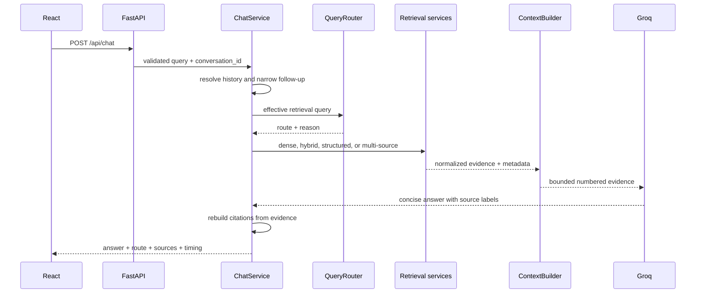
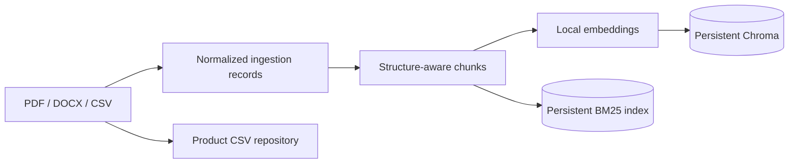

# Architecture

NovaCart separates data preparation, retrieval, orchestration, generation, and
delivery so each layer can be tested or replaced independently.

## Runtime request flow

FastAPI routes contain validation and HTTP error mapping. `ChatService` owns
conversation behavior, while `UnifiedRAGService` owns routing, retrieval,
context construction, and generation. Retrieval implementations share a
normalized result model, and all routes become normalized `Evidence` before
context construction.

## Data preparation flow

PDF pages and DOCX sections retain their structure. CSV rows remain whole
records. Chunk IDs and source metadata survive embedding, indexing, retrieval,
context construction, and citation generation.

## Trust boundaries

- LLM output never creates source metadata. Citation labels are resolved against
  evidence included in the prompt.
- Empty evidence skips generation and returns a fixed not-found response.
- Structured product facts are loaded through a repository abstraction rather
  than read directly inside routes.
- API users receive stable service errors without provider stack traces.
- CORS accepts only explicitly configured origins; wildcard origins are
  rejected during settings validation.

## Deployment

Local development runs Vite and Uvicorn separately. Docker Compose uses:

- an optional one-shot indexer,
- FastAPI with named volumes for indexes and model cache,
- an Nginx container serving the React build and proxying `/api`.

The vector store is embedded Chroma, so no Qdrant service is present.
